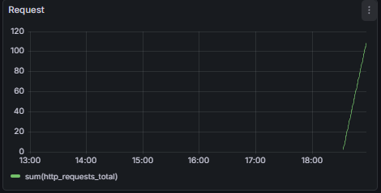
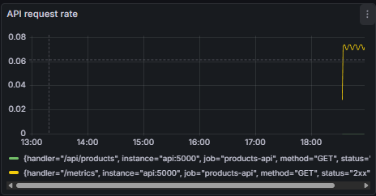
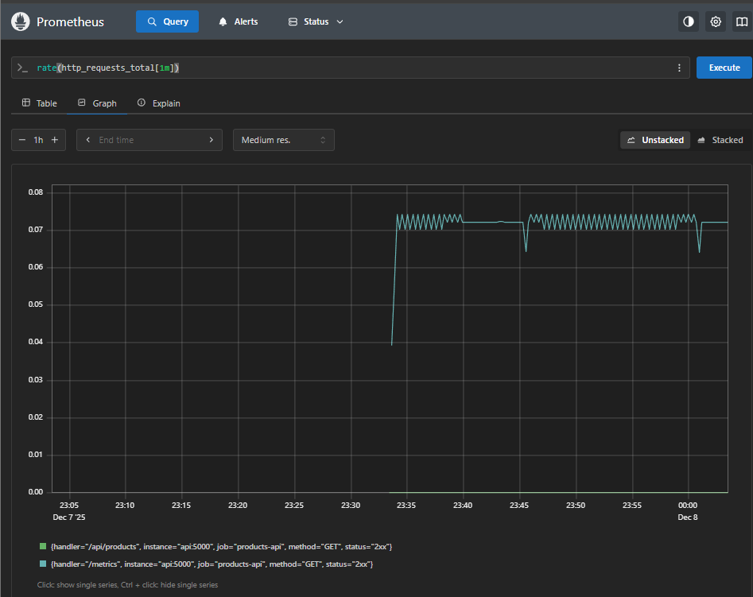

Logging with FastAPI, Prometheus, Grafana, Loki & Promtail

It includes FastAPI, MySQL, Prometheus, Grafana, Loki, and Promtail, all running through Docker Compose. Prometheus automatically scrapes /metrics while Grafana provides dashboards for visualization. Promtail collects container logs and forwards them to Loki, which can be queried inside Grafana → Explore.

To run the project:
```
docker-compose up -d
```

Endpoints:

http://localhost:5000/api/products

http://localhost:5000/metrics

http://localhost:3000/dashboards
 (Grafana)






http://localhost:9090
 (Prometheus)

 

A test endpoint /force-error generates logs to verify that Loki and Promtail are working correctly.

Stopping the Environment
```
docker-compose down
```